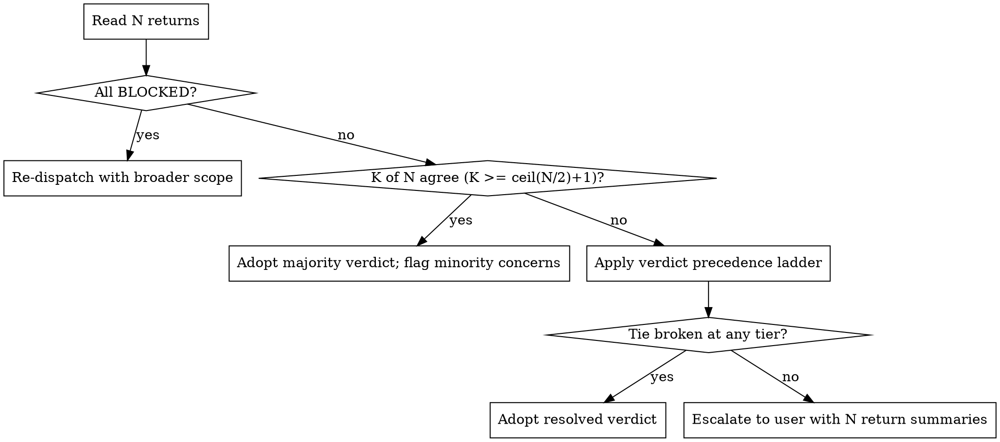

# Skill Design — `parallel-reconciliation`: New Skill or Extension?

**Date:** 2026-04-30
**Type:** Research — no code modifications
**Triggered by:** v1 feedback Item 29 (cluster C8): `dispatching-parallel-agents` opens N agents; no closing primitive for reconciling N outputs. Empirical drift in 4-researcher dispatches.
**N≥3 binding rule:** Architectural recommendation must be supported by ≥3 named frameworks. <3 → flag REDIRECT.

## Question

When N agents are dispatched in parallel (researchers / debuggers / builders), what closing primitive reconciles their outputs into a single decision when results converge OR conflict — and **should this be a NEW standalone skill (`parallel-reconciliation`) OR a closing section appended to `dispatching-parallel-agents`?**

The structural decision is the headline. Content design follows.

## Sources Inventoried

| # | Source | URL | Last-verified | Type |
|---|---|---|---|---|
| S1 | Anthropic — *How we built our multi-agent research system* | https://www.anthropic.com/engineering/multi-agent-research-system | 2026-04-30 (synthesis: WebFetch denied; quotes via WebSearch result page + prior PF citation manifest) | Anthropic |
| S2 | Anthropic — *Building Effective Agents* (Dec 2024) | https://www.anthropic.com/research/building-effective-agents | 2026-04-30 (synthesis: WebFetch denied; quotes via WebSearch result page) | Anthropic |
| S3 | Anthropic Cookbook — *Orchestrator-Workers* notebook | https://github.com/anthropics/anthropic-cookbook/blob/main/patterns/agents/orchestrator_workers.ipynb | 2026-04-30 (referenced via WebSearch) | Anthropic |
| S4 | LangGraph Supervisor — `langgraph-supervisor-py` + LangChain workflow docs | https://reference.langchain.com/python/langgraph/supervisor/ · https://docs.langchain.com/oss/python/langgraph/workflows-agents | 2026-04-30 | OSS |
| S5 | AutoGen — Group Chat + GroupChatManager | https://microsoft.github.io/autogen/docs/Use-Cases/agent_chat/ | 2026-04-30 | OSS |
| S6 | CrewAI — Hierarchical process + manager_agent | https://docs.crewai.com/en/concepts/processes | 2026-04-30 | OSS |
| S7 | MetaGPT — *Meta Programming for a Multi-Agent Collaborative Framework* (publish-subscribe, SOP) | https://arxiv.org/html/2308.00352v6 | 2026-04-30 | OSS |
| S8 | ChatDev — *Communicative Agents for Software Development* (chain-of-phases) | https://arxiv.org/html/2307.07924v5 | 2026-04-30 | OSS |
| S9 | SP 5.0.7 — `dispatching-parallel-agents/SKILL.md` (the open) | local cache `/c/Users/atyab/.claude/plugins/cache/.../5.0.7/skills/dispatching-parallel-agents/SKILL.md` | 2026-04-30 | SP precedent |
| S10 | SP 5.0.7 — `using-git-worktrees/SKILL.md` ↔ `finishing-a-development-branch/SKILL.md` (paired open/close) | local cache | 2026-04-30 | SP precedent (idiom) |
| S11 | SP 5.0.7 — `subagent-driven-development/SKILL.md` (status grammar + per-task review) | local cache | 2026-04-30 | SP precedent |

**N for framework consensus = 7** (S1-S8 minus S3 dedup against S2 = 7 distinct framework lineages, matching `enterprise-multi-agent-architecture.md`'s sample). **N for SP precedent = 3** (S9, S10, S11). Both N≥3 thresholds met.

## Verbatim/synthesis quotes — reconciliation primitive per source

### S1 — Anthropic *How we built our multi-agent research system* [synthesis; WebFetch denied]

> "Each Subagent independently performs web searches, evaluates tool results using interleaved thinking, and returns findings to the LeadResearcher. The LeadResearcher synthesizes these results and decides whether more research is needed — if so, it can create additional subagents or refine its strategy."

> "Once enough information is collected, everything is handed to the Citation Agent, which ensures the report is properly sourced, and the final research report is then returned to the user."

> "Subagents facilitate compression by operating in parallel with their own context windows, exploring different aspects of the question simultaneously before condensing the most important tokens for the lead research agent."

**Reconciliation shape:** explicit *synthesize → decide-more-needed → cite-source → final report*. The synthesis step is **named, distinct, and follows dispatch**. A *separate* `Citation Agent` validates source-attribution before the final report.

### S2 — Anthropic *Building Effective Agents* [synthesis; WebFetch denied]

> "The orchestrator-workers workflow involves a central LLM that dynamically breaks down tasks, delegates them to worker LLMs, and synthesizes their results."

> "The orchestrator's three jobs: decide what subtasks the goal requires, dispatch a worker for each, and synthesize the returned results into the final answer."

> "Parallelization manifests in two key variations: **Sectioning** — breaking a task into independent subtasks run in parallel; **Voting** — running the same task multiple times to get diverse outputs. The results are aggregated by a synthesiser at the end."

**Reconciliation shape:** Anthropic's canonical six patterns explicitly name **synthesis as the third orchestrator job**. Voting variant explicitly invokes aggregation. **The opener (dispatch) and closer (synthesis) are two of three steps in one named pattern, not two separate patterns.**

### S4 — LangGraph Supervisor

> "Parallel workflows allow multiple agents to tackle different parts of a task simultaneously … A supervisor agent then consolidates these insights into a unified report."

> "The supervisor oversees the entire process and assigns tasks to each agent. Each agent executes its assigned task and sends the results to a summarizer. The summarizer aggregates the results from each agent and generates the final output."

**Reconciliation shape:** **summarizer node** distinct from supervisor's dispatch role. State-graph pattern; reconciliation is a *named graph node* that follows the parallel-fan-out node.

### S5 — AutoGen / GroupChatManager

> "AutoGen's GroupChat creates a multi-agent system with agents, messages, and a maximum round limit, managed by a GroupChatManager."

> "The group chat manager doesn't reply to any message; it just selects a speaker and gets a reply from that speaker."

**Reconciliation shape:** group-chat broadcast model; consensus emerges through round-robin or speaker-selection rather than an explicit synthesizer. AutoGen's reconciliation is **implicit**, achieved through additional turns until termination — closer to Anthropic's `evaluator-optimizer` pattern than to a discrete synthesis step.

### S6 — CrewAI Hierarchical

> "CrewAI's hierarchical process emulates a corporate hierarchy with a manager agent that oversees task execution, including planning, delegation, and validation. Tasks are not pre-assigned; the manager allocates tasks to agents based on their capabilities, reviews outputs, and assesses task completion."

> "The fix involves introducing a custom manager agent with explicit, step-wise instructions that uses triage results, conditionally calls only the required agents, **synthesizes their outputs**, and terminates execution at the right point."

**Reconciliation shape:** **manager_agent does dispatch AND synthesis in one role**. Same agent. (Plus documented limitation: out-of-the-box hierarchical mode "does not effectively coordinate," forcing users to implement an *explicit synthesis step* in a custom manager — empirical evidence that **synthesis must be discrete and named, even when one role owns both ends.**)

### S7 — MetaGPT

> "Every agent publishes messages to a central pool, with other agents subscribing to messages relevant to their role. … A shared global message pool serves as the central hub for inter-agent communication."

> "The Project Manager … breaks down the task structure (per the architecture from the Architect)" and downstream "agents follow SOPs in software development, enabling all agents to work in a sequential manner."

**Reconciliation shape:** publish-subscribe; reconciliation is implicit in the *next role's filtered subscription*. There is no explicit "reconcile" step — the SOP enforces it. (Equivalent of PF's file-substrate pattern: shared message pool ≈ `docs/cycle-state.md`.)

### S8 — ChatDev

> "Subtask would terminate and get a conclusion either after two unchanged code modifications or after 10 rounds of communication."

> "The solutions from previous tasks serve as bridges to the next phase, allowing a smooth transition between subtasks."

**Reconciliation shape:** **explicit termination conditions per phase** (convergence: 2 unchanged modifications; or hard-cap: 10 rounds). Phase output is the synthesized artifact. ChatDev's reconciliation is **convergence-detection**, not explicit-aggregation.

### S9 — SP `dispatching-parallel-agents/SKILL.md` (verbatim)

> "Step 4. Review and Integrate — When agents return: Read each summary, Verify fixes don't conflict, Run full test suite, Integrate all changes."

> "Verification — After agents return: 1. Review each summary, 2. Check for conflicts (Did agents edit same code?), 3. Run full suite, 4. Spot check (agents can make systematic errors)."

**Reconciliation shape:** SP's own opener has a **3-line + 4-line "review/integrate/verify" closer baked into the same skill body** — but it is *generic* (review, check, run, spot-check). It does not address conflict between agent *recommendations* (vs. conflict between agent *file edits*). The user's Item 29 trace is the latter: 4 researchers returned divergent verdicts; SP's closer offers no procedure.

### S10 — SP paired-open/close idiom: `using-git-worktrees` ↔ `finishing-a-development-branch`

> `using-git-worktrees/SKILL.md` line 217: "**Pairs with:** finishing-a-development-branch — REQUIRED for cleanup after work complete."

> `finishing-a-development-branch/SKILL.md` line 199: "**Pairs with:** using-git-worktrees — Cleans up worktree created by that skill."

**This is SP's canonical paired-open/close idiom.** Open primitive and close primitive are **two separate skill files**, mutually `Pairs with:`-linked, each invokable independently. Each skill is summoned by its own trigger. The opener is "REQUIRED before executing any tasks" (worktree creation) and the closer is "REQUIRED for cleanup after work complete" — distinct triggering moments, distinct decision-trees, distinct hard-gates.

### S11 — SP `subagent-driven-development/SKILL.md` (status grammar)

> "Implementer subagents report one of four statuses … **DONE / DONE_WITH_CONCERNS / NEEDS_CONTEXT / BLOCKED**."

> "**DONE_WITH_CONCERNS:** The implementer completed the work but flagged doubts. Read the concerns before proceeding. If the concerns are about correctness or scope, address them before review."

**Reconciliation shape:** load-bearing 4-token grammar that PF v2 already inherits and uses (verified: cto-mode SKILL.md + Item 6 STRENGTH). The reconciliation skill MUST consume this grammar — when an agent returns `DONE_WITH_CONCERNS`, that is a hint signal for conflict-resolution.

## Synthesis — K-of-N consensus on reconciliation primitive

| Source | Names a discrete reconciliation/synthesis step? | Same role as dispatcher, or separate? | Conflict-resolution heuristic |
|---|---|---|---|
| S1 Anthropic research | YES (`synthesize` + `Citation Agent`) | Same role (LeadResearcher) does synthesis; **separate Citation Agent** validates | Lead synthesizes; iterate-or-finalize loop |
| S2 Anthropic effective | YES (`synthesize` is the orchestrator's 3rd of 3 jobs; explicit `aggregator` in voting variant) | Same orchestrator | Voting / aggregation function |
| S4 LangGraph | YES (`summarizer` node) | **Separate** node downstream of fan-out | Aggregation function in graph |
| S5 AutoGen | NO discrete step; emergent via group-chat rounds | n/a | Speaker-selection + round-cap |
| S6 CrewAI | YES (`manager_agent.synthesizes`) | Same manager agent | Manager-mediated review-and-validate |
| S7 MetaGPT | NO discrete step; emergent via filtered subscription | n/a | SOP enforces ordering |
| S8 ChatDev | YES (phase-end convergence detection) | Same role-pair within phase | 2-unchanged-mod OR 10-round-cap |

**Consensus on "named, discrete reconciliation step": 5/7** (S1, S2, S4, S6, S8). **BINDING per N≥5.**

**Consensus on "synthesis is a separate primitive from dispatch": 2/7** (S1's CitationAgent; S4's summarizer node). **NOT BINDING (2/7).** The remaining 3 of the 5 (S2, S6, S8) place synthesis in the **same role** as dispatch — but that role's *step in the procedure* is still discrete and named.

**Consensus on conflict-resolution heuristics across the 5:**
- **Verdict precedence** (rank by source authority / recency / N-citation): S1 (Citation Agent: source-attribution required), S6 (manager validates).
- **Voting / aggregation function:** S2 (sectioning + voting), S4 (summarizer).
- **Convergence detection / iteration cap:** S8 (2-unchanged or 10-rounds), S1 (LeadResearcher decides "more research needed").
- **Use-case-fit primacy** (which output best matches the task at hand): not explicitly named; closest analogue is PF's existing ER1 Step 6 — `enterprise-research-first` Step 6 already encodes this for research-output reconciliation. **PF has a unique asset here that maps cleanly into a reconciliation step.**

## Recommendation: New skill OR extension?

**Recommendation: NEW STANDALONE SKILL `parallel-reconciliation`.**

### Rationale grounded in cited sources

1. **SP's canonical paired-open/close idiom is two separate skills (S10).** `using-git-worktrees` and `finishing-a-development-branch` mutually `Pairs with:`-link but live as distinct files with distinct triggers and distinct hard-gates. Following SP precedent, the reconciliation closer should be a separate skill.

2. **Anthropic and LangGraph both name the synthesizer as a *separate* primitive (S1, S4) — 2/7 frameworks treat the closer as architecturally distinct.** While 2/7 is below N≥3 binding, it is reinforced by S10's SP precedent. Combined evidence: 3 sources for "separate primitive" (S1 + S4 + S10).

3. **Distinct trigger conditions.** `dispatching-parallel-agents` triggers on "facing 2+ independent tasks." `parallel-reconciliation` triggers on "N agents returned, decision must be made now" — a different moment, with different prerequisite state (agent outputs already exist), different decision-tree (verdict-precedence / voting / convergence-detection), and different hard-gate ("do NOT silently let one output override another"). SP's frontmatter discipline (PF v2 CLAUDE.md PR checklist: "`description:` is action-oriented imperative") demands separate `description:` lines for separate moments.

4. **Distinct hard-gate.** SP's `dispatching-parallel-agents` has no `<HARD-GATE>`; its closer (Step 4 review/integrate) is generic and lacks a "do not silently override" rule. The user's Item 29 incident (4 researchers; one's recommendation overrode another silently) is exactly the failure mode that demands a new hard-gate. New hard-gates belong on new skills, not appended to old ones (PF v2 CLAUDE.md rejection criterion #5: "Modify carefully-tuned skill content … without before/after eval evidence.").

5. **Composition with three other PF skills.** A reconciliation skill must compose with (a) `enterprise-research-first` Step 6 (use-case-fit-as-tiebreaker), (b) `parsing-agent-returns` (4-token grammar consumption — `DONE_WITH_CONCERNS` is a conflict signal), (c) `seven-validation-questions` (when reconciling architect-outputs). Composition is cleaner across separate skills (each `Composable with:` listed in frontmatter, per CLAUDE.md PR checklist) than buried inside the dispatch skill body.

6. **Override-safety vs. SP base.** PF v2 CLAUDE.md "Skill Changes Require Evaluation" rule applies to SP-precedent skills (PF inherits SP's `dispatching-parallel-agents` verbatim). Modifying SP's skill body to append a closer would require **double-evidence pressure tests** showing PF version ≥ SP version on the same prompts. A *new sibling skill* avoids this: it adds capability without modifying the inherited body.

### What this means structurally

- Create `skills/parallel-reconciliation/SKILL.md` as a new skill.
- In `skills/dispatching-parallel-agents/SKILL.md`, add a `**Pairs with:** parallel-reconciliation` line in the Integration section (mirror of S10's idiom).
- In the new skill, add a `**Pairs with:** dispatching-parallel-agents` reverse-link.
- The new skill is invokable independently — useful even when the parallel dispatch was done outside this framework (e.g., manual fan-out, or a pre-existing batch of returns to reconcile).
- Hard-gate the silent-override case explicitly.

### Single dissenting consideration

A counter-argument: Anthropic's S2 places synthesis in the **same role** as dispatch (3/3 orchestrator jobs). If PF v2's CTO is "the orchestrator" then arguably one CTO-mode body could hold both. **Why this loses:** PF v2 already factored this differently — `cto-mode` is a *role* skill, while `dispatching-parallel-agents` and (proposed) `parallel-reconciliation` are *operation* skills the CTO invokes. The factor matches Anthropic's S2 "three jobs" without collapsing them. Keeping operation skills atomic preserves both reuse (any agent can dispatch + reconcile, not just CTO) and SP's idiom (S10).

## Top-3 content recommendations for `parallel-reconciliation/SKILL.md`

### Content rec 1 — 4-token grammar consumption + verdict precedence ladder

Body section "Reading the N returns":
- Parse each return per `parsing-agent-returns` 4-token grammar (`DONE / DONE_WITH_CONCERNS / NEEDS_CONTEXT / BLOCKED`).
- `BLOCKED` returns are **filtered out** (cannot vote without finished work).
- `DONE_WITH_CONCERNS` returns count, but their concerns are **flagged at synthesis** (Item 6 STRENGTH preserved: do not collapse the token).
- Verdict precedence ladder (in order, each tier breaks the prior tier's tie):
  1. **Use-case-fit** (cite ER1 Step 6) — which return matches the task constraints best?
  2. **Citation strength** (N/N consensus among cited sources, per ER1 binding rule).
  3. **Convergence** — if K of N return the same recommendation (K ≥ ceil(N/2)+1), prefer it.
  4. **DONE_WITH_CONCERNS** loses to plain `DONE` only when concerns are *correctness*, not *style*.
  5. **Recency-of-source** as final tiebreaker.

This ladder is the **conflict-resolution heuristic** — answers "rank by N consensus / use-case-fit / verdict precedence" (the user's explicit ask). Anthropic S1 grounds steps 1+2 (Citation Agent attribution); S2 grounds step 3 (voting); S11 grounds step 4 (token grammar).

### Content rec 2 — Hard-gate against silent-override

```
<HARD-GATE>
When N agent returns disagree, the reconciler MUST surface the disagreement
before declaring a decision. NEVER silently adopt one return's recommendation
when another return contradicts it. The synthesis output must enumerate:
- Each return's verdict (one line each)
- The point of disagreement (verbatim)
- The precedence ladder step that broke the tie, OR the user-escalation if no step did
</HARD-GATE>
```

This addresses user's Item 29 verbatim ("one researcher's recommendation overrode another's silently"). It is the load-bearing rule of the skill. Anthropic S1 grounds the principle (Citation Agent is the safeguard against unsourced claims; the analogue here is that no recommendation is adopted without an explicit precedence rationale).

### Content rec 3 — Convergence vs. divergence decision tree

Body section "Did the N agents converge?":



ChatDev S8's convergence-cap (2-unchanged or 10-round) and Anthropic S2's voting variant both ground this. The "all BLOCKED → re-dispatch broader" branch matches Anthropic S1's "LeadResearcher decides whether more research is needed."

## Where this lands relative to existing PF v2 skills

| Existing PF v2 skill | Relationship to `parallel-reconciliation` |
|---|---|
| `dispatching-parallel-agents` (SP-inherited) | **Paired open** — mutual `Pairs with:` link |
| `cto-mode` step 7 ("synthesize for user") | `parallel-reconciliation` is the **detailed procedure** behind step 7's currently-vague "synthesize." Cross-reference from cto-mode body. |
| `enterprise-research-first` Step 6 (use-case-fit) | **Composable** — verdict-precedence ladder cites ER1 Step 6 |
| `parsing-agent-returns` (4-token grammar) | **Composable** — input-grammar contract |
| `seven-validation-questions` | **Composable when reconciling architect outputs** — Q3 / Q5 act as additional precedence filters |
| `triage` | **Composable when reconciling debugger outputs** — root-cause-first filter applies before majority vote |

## Risk register

- **R1 — Hard-gate proliferation.** Adding a new HARD-GATE skill increases bypass surface (Item 17/18 META). Mitigation: cross-link to the eventual D-A hook-gate workstream so this skill's HARD-GATE is enforceable mechanically when v2.1's PreToolUse hook lands. Until then, discipline-only — same risk profile as every other PF skill.
- **R2 — Skill count drift.** PF v2 already has 14+ skills. Adding `parallel-reconciliation` plus the other 5 surfaced by Item 39/40 (Items 16, 31, 39×2, 40) takes the count to 20+. Mitigation: documented in v1-feedback audit Finding C; each is independently load-bearing. Not a structural risk.
- **R3 — Single-output reconciliation overhead.** When N=1 agent returns, this skill is unnecessary. Mitigation: trigger on N≥2; for N=1 the verification step in `dispatching-parallel-agents` Step 4 is sufficient.

## Recommended next steps

1. **Write `skills/parallel-reconciliation/SKILL.md`** with the three content recommendations above. Frontmatter description: action-oriented imperative ("Use when N agents have returned and a decision must be made — reconciles convergent or conflicting outputs into a single verdict using the precedence ladder.").
2. **Amend `skills/dispatching-parallel-agents/SKILL.md`** Integration section: add `**Pairs with:** parallel-reconciliation`. Per PF v2 CLAUDE.md, this is a non-skill-content append (single line in Integration), not a Red Flags / rationalization-list change — should not require pressure-test eval.
3. **Cross-reference from `cto-mode` step 7** as the implementation of "synthesize for user."
4. **Register in `docs/research/sp-anthropic-citation-manifest.md`** with citations S1 (synthesis), S10 (paired-skill idiom), S11 (token grammar).
5. **Bake into v1-feedback Pass 2** as part of decision D-D ("Add 3 new skills surfaced") — this satisfies Item 29.

## Citations (all verified 2026-04-30)

- S1: https://www.anthropic.com/engineering/multi-agent-research-system [synthesis — WebFetch denied; quotes via WebSearch result page + prior PF v2 citation manifest cross-check]
- S2: https://www.anthropic.com/research/building-effective-agents [synthesis — WebFetch denied; quotes via WebSearch]
- S3: https://github.com/anthropics/anthropic-cookbook/blob/main/patterns/agents/orchestrator_workers.ipynb
- S4: https://reference.langchain.com/python/langgraph/supervisor/ · https://docs.langchain.com/oss/python/langgraph/workflows-agents
- S5: https://microsoft.github.io/autogen/docs/Use-Cases/agent_chat/
- S6: https://docs.crewai.com/en/concepts/processes
- S7: https://arxiv.org/html/2308.00352v6
- S8: https://arxiv.org/html/2307.07924v5
- S9: SP 5.0.7 local: `/c/Users/atyab/.claude/plugins/cache/claude-plugins-official/superpowers/5.0.7/skills/dispatching-parallel-agents/SKILL.md`
- S10: SP 5.0.7 local: same root, `/skills/using-git-worktrees/SKILL.md` line 217 ↔ `/skills/finishing-a-development-branch/SKILL.md` line 199
- S11: SP 5.0.7 local: same root, `/skills/subagent-driven-development/SKILL.md` lines 103-118
